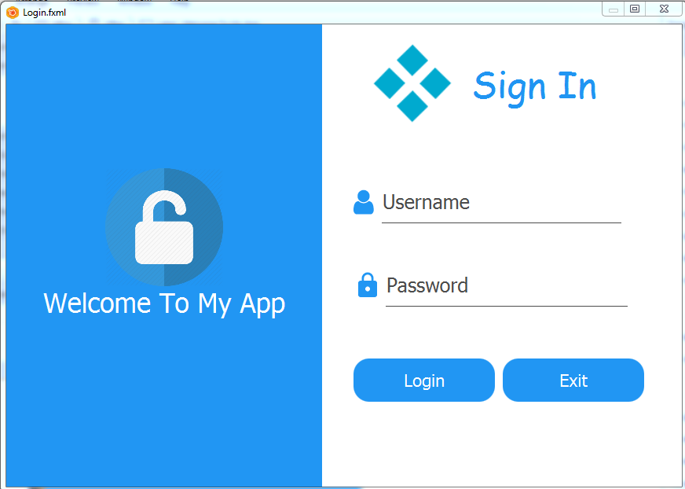

# Practice JavaFx Tutorial Course
Step by step to build JavaFx Apps. Code files for YouTube tutorial, Check the videos tutorial [**Here**](https://www.youtube.com/watch?v=FEN0xA_fuqs&list=PLd5-bvEurdb_Tg4t-G5SM5wlmEHjUpH8G)

## Screenshots

| Charts - Pie Chart | Charts - Bar Chart |
|:---------:|:---------:|
|  |  |
| Sign In [Model 1] | Sign In [Model 1] |
|  |  |
| About |
|  |

### Contact me
Email: houarizegai14@gmail.com  
LinkedIn: [HouariZegai](https://linkedin.com/in/houarizegai)  
Twitter: [@HouariZegai](https://twitter.com/houarizegai)